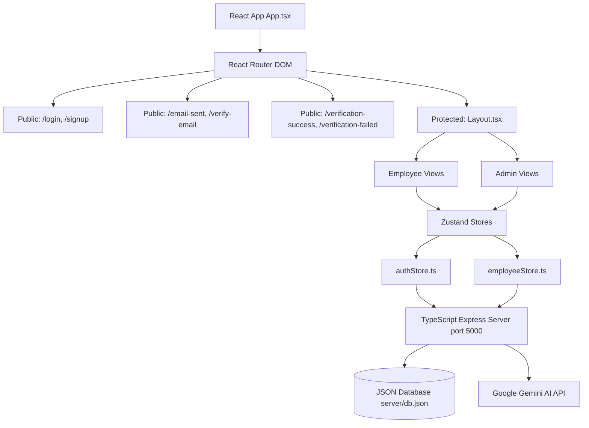

# HRMS-ODOO-X-DEVINS

An enterprise-grade Human Resource Management System (HRMS) featuring a beautiful Odoo-inspired purple and white theme, designed for the Odoo x Adamas University Hackathon 2026. 

This platform digitizes critical corporate HR activities: dynamic employee onboarding, real-time geofenced attendance punches, leave management workflow, payslip records, profile management, comprehensive admin analytics panels, and a secure **Email Verification System**.

---

## 🚀 Tech Stack

- **Frontend Core**: React 19 + TypeScript + Vite 8
- **Styling**: Tailwind CSS v4 (incorporating modern grid layout and glassmorphic filters)
- **Routing**: React Router DOM v7
- **State Management**: Zustand v5
- **Forms & Validation**: React Hook Form + Zod v4 schemas
- **Backend Database Server**: Express.js + Node.js + TypeScript (with JSON file-based database persistence in `server/db.json`)
- **Security & Mail**: JWT verification tokens + Bcrypt password hashing (12 salt rounds) + Nodemailer
- **Artificial Intelligence**: Google Gemini AI API (via `@google/generative-ai`)
- **Icons**: Lucide React
- **Interactive Calendar**: FullCalendar Scheduler
- **Visual Analytics**: Recharts
- **Alert System**: Sonner (rich color toasts)

---

## 🛠️ Project Architecture



---

## ✨ Features Checklist

### 1. Role-Based Authentication & Verification
- **Secure Sign In & Sign Up**: Includes validation rules for strong passwords and email verification.
- **Bcrypt Hashing**: User passwords are encrypted on the backend with 12 salt rounds.
- **Verification Tokens**: JWT verification links with a 24-hour expiration are sent on signup.
- **Login Protection Guard**: Unverified users are blocked from logging in with an inline alert banner offering to resend the verification link.
- **Rate Limiting**: Resend endpoint is rate-limited to a maximum of 3 requests per hour per email to prevent spam.

### 2. Employee Dashboard
- **Analytics Widgets**: Displays monthly attendance percentages, remaining leave days, current month earnings, and custom timeline logs.
- **Interactive Graphing**: Visualizes daily work hours using Recharts area logs.
- **Holiday Widget**: Displays upcoming holidays (Diwali, Gandhi Jayanti, Christmas, etc.).

### 3. Profile Vault
- **Multi-Tab Layout**: Features tabs for Personal Details, Job & Compensation, and Document Vault.
- **Interactive Avatar Change**: Encodes and saves profile pictures to the database.
- **Permissions Guard**: Standard users can edit only contact details, address, and avatar. Admins have full access.

### 4. Attendance Monitoring
- **Header punch widget**: Check in or check out from the header of any page.
- **Workspace Views**: Includes standard calendar logs, detailed history tables, and pie-chart breakdown metrics.

### 5. Leave Request Flow
- **Request Form**: Choose leave type, select start/end dates, state reason, and attach files (validated by Zod).
- **Admin Approvals Panel**: HR Admin reviews pending leaves, appends comments, and approves/rejects. Balances automatically deduct on approval.

### 6. Company Payroll Engine
- **Payslips Disbursal**: HR Admin runs monthly payroll cycles to generate slips for the workforce and disbursements.
- **Download Slip**: Print-friendly, audit-verified pay receipts simulating corporate ERP slips.

### 7. Gemini AI HR Copilot
- **Interactive Floating Chatbot**: Chat with an AI assistant that has full context about your active profile, leave balances, and attendance stats.
- **Admin AI Summary Reports**: Admins can generate on-demand performance, leave compliance, and workload analysis summaries.

---

## 🔑 Authentication API Endpoints

| Endpoint | Method | Input Parameters | Description |
|:---|:---|:---|:---|
| `/api/auth/register` | `POST` | `employeeId`, `fullName`, `email`, `role`, `department`, `designation`, `password` | Hashes password, creates unverified user, sends JWT verification email |
| `/api/auth/verify-email/:token` | `GET` | URL param `token` | Validates JWT token, marks user as verified, redirects to `/verification-success` |
| `/api/auth/login` | `POST` | `email`, `password` | Checks password, verifies `isVerified === true`, logs user in |
| `/api/auth/resend-verification` | `POST` | `email` | Generates a fresh JWT verification token and sends email (Rate limit: 3/hr) |

---

## 📦 Installation & Setup

Ensure you have [Node.js](https://nodejs.org/) installed.

1. **Clone the workspace and navigate to the directory**:
   ```bash
   cd HRMS-ODOO-X-DEVINS
   ```

2. **Install all required dependencies (frontend & backend)**:
   ```bash
   npm install --legacy-peer-deps
   ```

3. **Configure Environment Variables**:
   Create a `.env` file in the root directory (a template is provided) and insert your Gemini API Key:
   ```env
   PORT=5000
   GEMINI_API_KEY=AQ.Ab8RN6IfNM8PCMgjz99RWPaJA6VeLmo3uoaSsGAMvQh753BqZQ
   JWT_SECRET=odoo-x-devins-secret-key-123456
   BACKEND_URL=http://localhost:5000
   FRONTEND_URL=http://localhost:5173

   # SMTP Configuration (Optional - falls back to printing URLs in console if empty)
   SMTP_HOST=
   SMTP_PORT=587
   SMTP_USER=
   SMTP_PASS=
   SMTP_FROM="HRMS OdooXDevins <no-reply@devins.com>"
   ```

4. **Start the TypeScript Express backend database server**:
   ```bash
   npm run server
   ```
   *Note: On startup, the backend will scan existing users in `server/db.json` and automatically hash their passwords and mark them as verified so you can sign in with mock credentials immediately.*

5. **Start the Vite frontend development server (in a separate terminal)**:
   ```bash
   npm run dev
   ```

6. **Compile and build for production**:
   ```bash
   npm run build
   ```

---

## 🔑 Mock Login Credentials

For convenience, you can test the application using the following mock accounts (auto-hashed and verified on backend startup):

| Role | Email Address | Password |
|:---|:---|:---|
| **HR / Admin** | `amit.sharma@devins.com` | `admin123` |
| **Employee** | `rohan.das@devins.com` | `password123` |

---

## 👨‍💻 Team Details (Devins)
- **Ayush** — Lead Full-Stack Architect
- **Team Devins** — Adamas University Hackathon 2026
